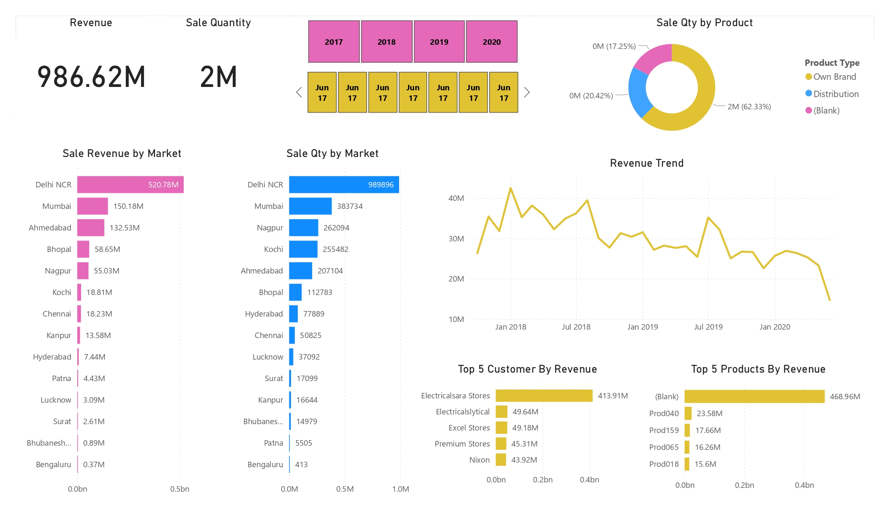

# Sales Insights and Data Analysis Project

## Overview
The Sales Insights and Data Analysis project aims to extract meaningful insights from raw sales data using SQL and Power BI. The project involves database setup, data cleaning, transformation, and visualization to enable data-driven decision-making.

---

### Importing the Database
1. The `db_dump.sql` file contains the database structure and sample data required for the analysis.
2. After downloading the file, it can be imported into MySQL as shown in the tutorial video.
3. Once the data is imported, queries can be executed to perform various analyses.

---

## Data Analysis Workflow

### 1. Data Exploration and Analysis Using SQL
- The database contains key tables such as `customers`, `transactions`, and `date`. 
- SQL was utilized to perform data exploration, including:
  - Identifying key customer metrics and transaction patterns.
  - Aggregating data to calculate total revenue, monthly revenue, and market-specific sales.
  - Joining tables to analyze trends based on temporal and categorical variables.
- Insights derived from SQL queries laid the foundation for further analysis and visualization.

---

### 2. Data Cleaning and Transformation in Power BI
- Raw data was imported into Power BI for cleaning and preparation, which involved:
  - Addressing inconsistencies such as missing or incorrect values.
  - Removing duplicates and ensuring data integrity.
  - Normalizing sales amounts by converting currencies into a single standard using calculated columns.
  - Integrating multiple tables to create a unified data model.
- Power Query Editor was used extensively for preprocessing and transformation tasks.

---

### 3. Data Modeling
- Relationships were established between the tables to support multi-dimensional analysis.
- A star schema model was created, ensuring optimized performance and simplified queries.
- Calculated columns and measures were added for custom metrics and derived values.

---

### 4. Data Visualization and Dashboard Creation
- An interactive dashboard was designed in Power BI to present key insights effectively. 
- Key features of the dashboard include:
  - Visualizations of total revenue by year, month, and market.
  - Slicers and filters for dynamic exploration of trends and patterns.
  - KPIs and summary cards for quick access to key metrics.
  - Graphs and charts to analyze product performance and market contributions.
- The dashboard enhances decision-making by providing clear and actionable visual representations.

---

### 5. Advanced Analysis Using DAX
- Data Analysis Expressions (DAX) were employed for:
  - Creating calculated columns for normalized sales and custom metrics.
  - Measures for aggregating data, such as cumulative revenue and year-over-year comparisons.
  - Time-based functions to analyze trends over different periods.
- DAX formulas were optimized for improved performance and accuracy in calculations.

---

### 6. Insights and Outcomes
- The analysis provided insights into market trends, revenue generation, and customer behavior.
- Market-specific performance was evaluated to identify high-performing regions and products.
- Monthly and yearly revenue trends were visualized for strategic planning.
- The dashboard serves as a valuable tool for monitoring performance and making data-driven decisions.

---

## Dashboard
The dashboard provides a comprehensive view of the sales data with intuitive and interactive visualizations. Below is a placeholder for the dashboard screenshot:

---

## Tools and Technologies Used
- **MySQL:** For database management and SQL queries.
- **Power BI:** For data cleaning, transformation, modeling, and visualization.
- **Power Query:** For preprocessing raw data.
- **DAX:** For advanced calculations and measures in Power BI.

---

### Contributions
Contributions to improve the analysis or visualizations are welcome. Fork this repository and share your enhancements or suggestions.

---

## Getting Started
To replicate the analysis:
1. Set up MySQL and import the database using `db_dump.sql`.
2. Use the SQL queries provided to explore and analyze the data.
3. Import the cleaned data into Power BI and follow the steps above to create the dashboard.
4. Add the dashboard screenshot to this repository for reference.
